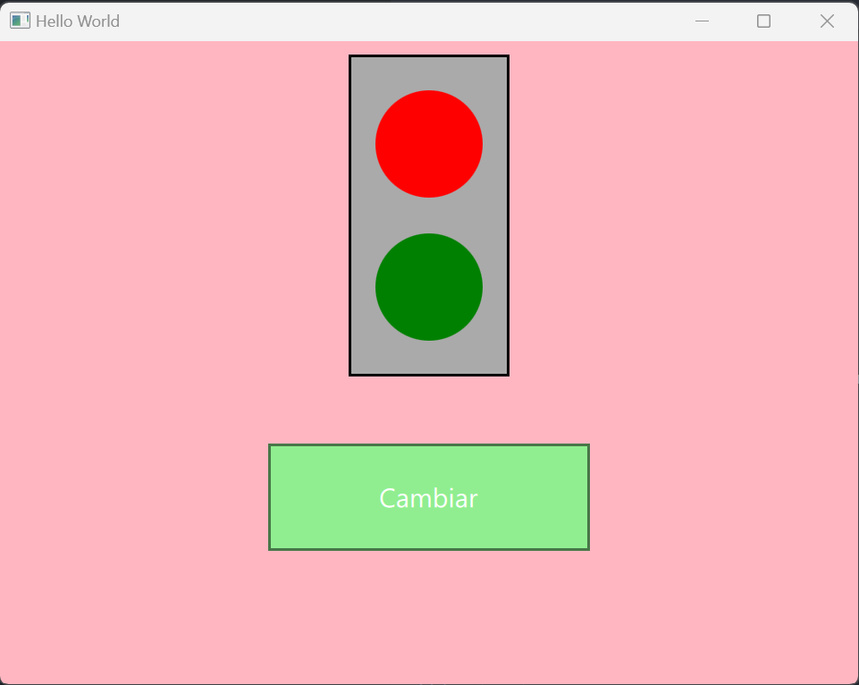

# TRAFIC LIGHT

The traffic light is a simple state machine with two states: red, y green.

The traffic light is controlled by a button. When the button is pressed, the traffic light changes state.

The traffic light is also controlled by a timer. When the timer expires, the traffic light changes state.

